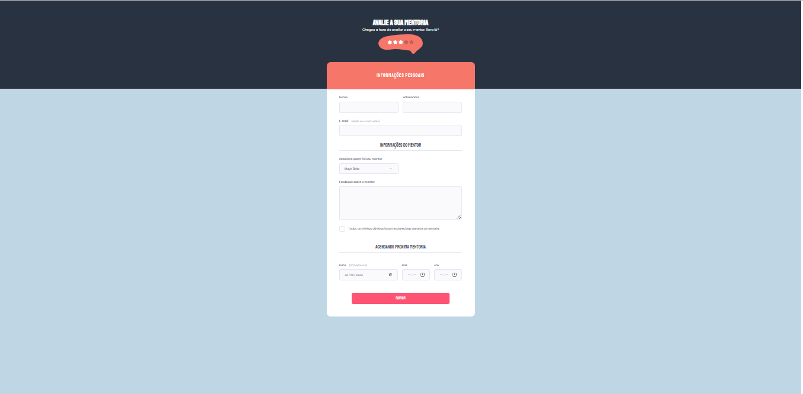

<h1 align="center">Avalie sua Mentoria</h1>

Desafio proposto pela equipe de instrutores da Rocketseat para o EXPLORER, para uma melhor compreensão do HTML e CSS.
 

  <a href="#-tecnologias">Tecnologias</a>&nbsp;&nbsp;&nbsp;|&nbsp;&nbsp;&nbsp;
  <a href="#-projeto">Projeto</a>&nbsp;&nbsp;&nbsp;|&nbsp;&nbsp;&nbsp;
  <a href="#-layout">Layout</a>&nbsp;&nbsp;&nbsp;|&nbsp;&nbsp;&nbsp;
  <a href="#memo-licença">Licença</a>

  

 

  

## 🚀 Tecnologias

Esse projeto foi desenvolvido com as seguintes tecnologias:

- HTML e CSS
- Git e Github

## 💻 Project

O projeto de formulario foi desenvolvido para estudar o uso do HTML e do CSS. Neste projeto, construimos um formulario de avaliação de uma mentoria. Entre os temas mais comuns estão:

- Estruturando um projeto HTML;
- Uso de tags HTML mais comuns;
- Conceitos iniciais de CSS;
- Adicionando entradas de texto e botões
- Posicionamento e alinhamento de elementos na tela;
- Aplicando fontes customizadas;
- Espaçamentos.

## 🔖 Layout

Você pode visualizar o layout do projeto através [DESSE LINK](https://www.figma.com/file/Nws1KWB7DyXBw8L6wXb9mp/Stage-03---Formul%C3%A1rio-intermedi%C3%A1rio/duplicate). É necessário ter conta no [Figma](https://figma.com) para acessá-lo.

## 🔗 Links
 

## 📝 Licença

 
Esse projeto está sob a licença MIT.

---
Feito com ♥ by Rocketseat 👋 [Participe da nossa comunidade!](https://discord.gg/rocketseat)

# Desafio 2 -Stage 3-Explorer-Rocketseat
